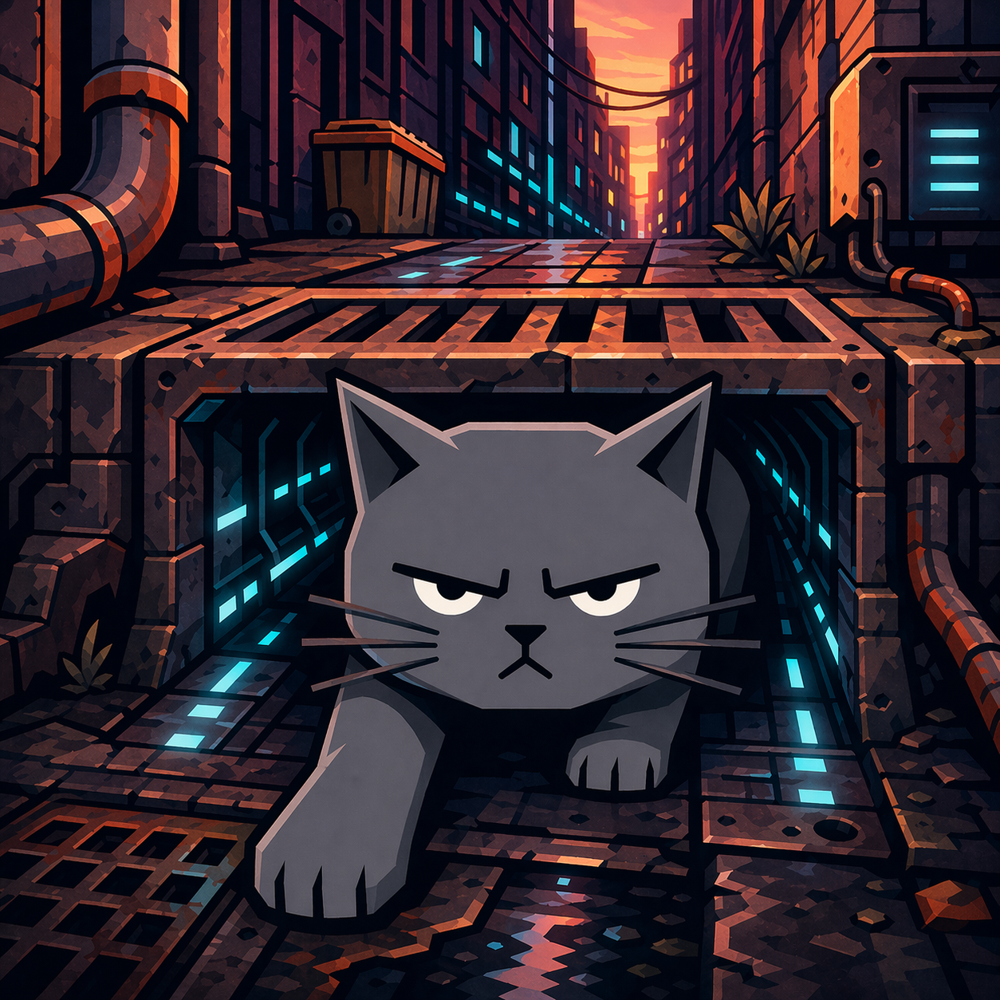

# Alleycat



Iroh-backed bridge that multiplexes a few local coding agents — Codex, Pi, Amp, OpenCode, Claude, Factory Droid, and Hermes — onto a single QUIC connection. Run the daemon on your machine, scan a QR with a paired client, and the client picks an agent over the same stream multiplexer.

## Install

End-user packages are published from the [`kittylitter`](https://github.com/dnakov/litter) project, which wraps this daemon under the `kittylitter` command. The currently enabled published channel is npm/bun; Homebrew, shell installer, PowerShell installer, and MSI publishing are not enabled in the release config right now. Source installs from this repo expose the daemon as `alleycat`.

| Platform | Install |
|---|---|
| npm / bun | `npm install -g kittylitter` &nbsp;or&nbsp; `bunx kittylitter` |
| From source | `cargo install --path crates/alleycat` (this repo) |

## First run

```bash
kittylitter install         # autostart at login (no admin)
kittylitter status          # node id, token, agent availability
kittylitter pair --qr       # phone-side QR
```

Use `alleycat` instead of `kittylitter` when running a source build from this repo.

The `install` command registers a launchd user agent on macOS, a systemd `--user` unit on Linux (with `.desktop` autostart fallback), or a Startup-folder shortcut on Windows. None of them require sudo.

The daemon spawns external coding-agent CLIs on demand — install whichever ones you'll use:

| Agent | Install |
|---|---|
| `claude` | `npm install -g @anthropic-ai/claude-code` (or `bun install -g @anthropic-ai/claude-code`). Then `claude /login` once. |
| `opencode` | See [opencode docs](https://opencode.ai). |
| `amp` | Install Amp from [ampcode.com/install](https://ampcode.com/install), then either run `amp login` once or set `AMP_API_KEY` in the daemon environment. |
| `pi` | See pi-mono docs. |
| `codex` | Install the `codex` CLI ([codex docs](https://github.com/openai/codex)). The daemon spawns `codex app-server` on demand. |
| `droid` | Install Factory Droid, then either run `droid login` once or set `FACTORY_API_KEY` in the daemon environment. |
| `hermes` | Install stock [Hermes Agent](https://github.com/NousResearch/hermes-agent). Alleycat prefers the Hermes gateway API on loopback and falls back to `hermes -z`; set `API_SERVER_KEY` or `HERMES_API_KEY` only in the daemon environment if your API server requires it. |

## Commands

The command surface is the same for `kittylitter` packaged installs and `alleycat` source builds. The table uses `alleycat` because this is the daemon repo.

| Command | What it does |
|---|---|
| `alleycat serve` | Run the daemon in the foreground (what `install` autostarts). |
| `alleycat install` / `uninstall` | Per-user autostart, idempotent. |
| `alleycat status [--json]` | Pid, node id, token fingerprint, uptime, agent availability. Falls back to a file-only readout if the daemon isn't running. |
| `alleycat pair [--qr]` | Print the stable pair payload, optionally with an ASCII QR code. |
| `alleycat rotate` | Mint a fresh token. Node id is preserved; the running daemon picks up the new token immediately. |
| `alleycat reload` | Re-read `host.toml` and swap agent config without restarting. |
| `alleycat agents list` | List configured agents and their availability. |
| `alleycat logs [-f]` | Tail the daemon log files. |
| `alleycat stop` | Graceful shutdown via the control socket. |

The daemon talks to the CLI over a Unix domain socket on macOS/Linux and a per-user named pipe on Windows. `status`, `pair`, and `rotate` round-trip through it when the daemon is up and fall back to file-only operations when it isn't, so first-run flows still work.

## What the daemon spawns

| Agent | Spawned by daemon? | How |
|---|---|---|
| `codex` | Yes, one shared backend | Uses Codex's Unix app-server socket by default: Alleycat lazy-spawns `codex app-server --listen unix://` only when no existing socket answers, then each iroh stream runs through `codex app-server proxy`. Older Codex CLIs fall back to `codex app-server --listen ws://<host>:<port>` or stdio. |
| `pi` | Yes, per codex thread | `PiPool` spawns `pi --mode rpc` on demand, bounded at 16 processes with a 10-minute idle reap and LRU eviction. |
| `amp` | Yes, per turn | Spawns `amp --execute --stream-json --stream-json-thinking --stream-json-input` for each turn, translates Amp stream JSON into codex app-server lifecycle events, stores Alleycat-owned thread records, and saves Amp's `T-*` thread id for continuation. |
| `opencode` | Yes, one shared backend | Lazy spawn of `opencode serve --port=auto --auth-token=auto` on first connect, gated on `/global/health`. Or set `OPENCODE_BRIDGE_BACKEND_URL` to point at an existing instance. |
| `claude` | Yes, per codex thread | `ClaudePool` spawns `claude -p --input-format stream-json --output-format stream-json --session-id <thread_id> --dangerously-skip-permissions` on demand. Same 16-cap, 10-minute idle reap, LRU eviction as pi. Sessions resume on next access via `--resume <thread_id>`. |
| `droid` | Yes, per codex thread | Spawns `droid exec --input-format stream-jsonrpc --output-format stream-jsonrpc --cwd <cwd>` and translates Factory session notifications into the codex app-server wire. |
| `hermes` | Yes, one turn per request | Uses stock Hermes gateway API (`/health`, `/v1/runs`, `/v1/runs/{id}/events`, `/v1/runs/{id}/stop`) when available, otherwise spawns `hermes -z <prompt>` and `--resume <session>` with argv-only process creation. API keys stay inside the daemon process and are never sent to paired clients. |

## Pair payload

`alleycat pair` prints:

```json
{
  "v": 1,
  "node_id": "<iroh public key>",
  "token": "<32-byte hex>",
  "relay": null
}
```

`relay` is optional and only set if the operator pinned a specific iroh relay in `host.toml`; otherwise iroh's default discovery applies. There is no port or cert fingerprint — iroh handles transport, the token authenticates the first JSON frame on every stream.

## Wire

ALPN `alleycat/1`. Each iroh bidirectional stream begins with a length-prefixed JSON request:

```json
{"op": "list_agents", "v": 1, "token": "..."}
```
or
```json
{"op": "connect", "v": 1, "token": "...", "agent": "codex"}
```

The daemon answers with `{ok, agents?, error?}`. On `connect`, after the response the stream becomes the agent's native wire — websocket frames for `codex` (the daemon proxies straight to the shared `codex app-server` listener), JSON-RPC over JSONL for `pi`, `amp`, `opencode`, `claude`, `droid`, and `hermes`.

## Configuration

`host.toml` is created on first run with sensible defaults; edit and `alleycat reload` to apply.

```toml
token = "..."          # 32 bytes hex; rotate via `alleycat rotate`
# relay = "https://..." # optional iroh relay override

[agents.codex]
enabled = true
bin = "codex"
host = "127.0.0.1"
port = 8390

[agents.pi]
enabled = true
bin = "pi"

[agents.amp]
enabled = true
bin = "amp"
api_key_env = "AMP_API_KEY"
dangerously_allow_all = true

[agents.opencode]
enabled = true
bin = "opencode"

[agents.claude]
enabled = true
bin = "claude"

[agents.droid]
enabled = true
bin = "droid"
api_key_env = "FACTORY_API_KEY"

[agents.hermes]
enabled = true
bin = "hermes"
api_base = "http://127.0.0.1:8642"
```

Reload swaps config that's read per-request (token, agent enable flags). Codex's `bin`/`host`/`port`, pi's `bin`, Amp's `bin`/permission mode, OpenCode's `bin`/runtime port, Droid's `bin`, and Hermes's `bin`/`api_base` are pinned at first spawn; changing those requires `alleycat stop` + `serve`. Codex `host`/`port` are only used by the legacy websocket fallback. For Hermes API mode, bind the Hermes gateway to loopback and put `API_SERVER_KEY`/`HERMES_API_KEY` only in the Alleycat daemon environment; mobile clients authenticate through Alleycat pairing and never receive the Hermes key.

## File layout

Per-OS, via `directories::ProjectDirs`:

|              | macOS                                                         | Linux                                | Windows                                   |
|--------------|---------------------------------------------------------------|--------------------------------------|-------------------------------------------|
| Config       | `~/Library/Application Support/dev.Alleycat.alleycat/host.toml` | `$XDG_CONFIG_HOME/alleycat/host.toml` | `%APPDATA%\Alleycat\alleycat\config\host.toml` |
| State        | (collapses to config dir) — `host.key`, `host.lock`, `daemon.pid` | `$XDG_STATE_HOME/alleycat/`        | `%LOCALAPPDATA%\Alleycat\alleycat\data\`  |
| Logs         | `~/Library/Logs/dev.Alleycat.alleycat/daemon.log`             | `$XDG_STATE_HOME/alleycat/logs/`     | `%LOCALAPPDATA%\Alleycat\alleycat\logs\`  |
| Control IPC  | `$TMPDIR/alleycat-<userhash>/control.sock`                    | `$XDG_RUNTIME_DIR/alleycat-<userhash>/control.sock` | `\\.\pipe\alleycat-control-<userhash>` |
| Autostart    | `~/Library/LaunchAgents/dev.alleycat.alleycat.plist`          | `~/.config/systemd/user/alleycat.service` (or `~/.config/autostart/alleycat.desktop`) | `…\Startup\alleycat.lnk` |

The Unix control socket falls through `XDG_RUNTIME_DIR` → state dir → `TMPDIR` → `/tmp` so the path always fits in `sockaddr_un.sun_path` (104 bytes on macOS/BSD, 108 on Linux), even under deeply nested hermetic test homes.

## Notes

- Codex, Pi, Amp, OpenCode, Claude, Droid, and Hermes children inherit `kill_on_drop` semantics, so they exit when the daemon does.
- `alleycat stop` shuts the iroh endpoint and the daemon process; launchd / systemd will restart it under their normal supervision.

## Building from source

```bash
cargo install --locked --path crates/alleycat
# or, for a workspace-relative build:
cargo build --release -p alleycat
target/release/alleycat install
```

The workspace crates are:

- `crates/alleycat` — `alleycat` daemon binary. Owns the iroh endpoint, the persistent identity, the agent dispatcher, and an OS-native control socket so the CLI can talk to the running daemon.
- `crates/amp-bridge` — Amp `--stream-json` process wrapper plus codex-shaped turn/tool translation and Alleycat-owned Amp thread records.
- `crates/bridge-conformance` — live conformance harness for comparing bridge behavior against codex app-server wire shapes.
- `crates/bridge-core` — shared JSON-RPC framing, server scaffolding, and notification plumbing used by the bridges.
- `crates/codex-proto` — shared codex `app-server` v2 wire shapes used by every bridge.
- `crates/pi-bridge` — `pi-coding-agent` process pool plus a codex-shaped JSON-RPC translator (one pi process per codex thread).
- `crates/opencode-bridge` — single shared `opencode serve` backend wrapped in the same JSON-RPC surface.
- `crates/claude-bridge` — `claude -p --output-format stream-json` process pool wrapped in the same JSON-RPC surface (one claude process per codex thread).
- `crates/droid-bridge` — Factory Droid `stream-jsonrpc` process wrapper plus codex-shaped turn/tool translation (one droid process per codex thread).
- `crates/hermes-bridge` — stock-Hermes API/CLI adapter that exposes Hermes as the codex app-server JSON-RPC surface for Alleycat clients.
- `crates/claude-remote-control` — auxiliary Claude remote-control protocol support.

Releases are produced from the [`litter`](https://github.com/dnakov/litter) repo, which carries this repo as a submodule under `shared/third_party/alleycat` and runs [`dist`](https://github.com/axodotdev/cargo-dist) against the `kittylitter` wrapper to build platform release artifacts and publish the npm package. Homebrew, shell installer, PowerShell installer, and MSI publishing are disabled in litter's release config right now. To cut a release: bump `version` in the root `Cargo.toml` here, push, then bump the submodule pin in litter and tag `vX.Y.Z` there.
